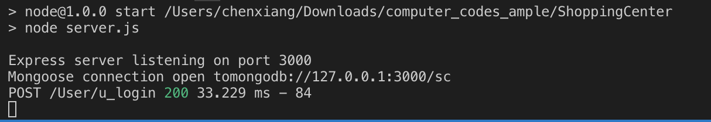

## Environmental configuration 

* Install [MongoDB Community Edition](https://docs.mongodb.com/manual/administration/install-community/)**（It also has Introduce on running the MongoDB Service）**

* Install [Nodejs and Npm](https://nodejs.org/en/download/)

## How to start it ?

**1.Install the modules**
```
cd (Project path)
npm install
```
**2.Run MongoDB** 

##### MongoDB Service Info:
* port (```3000```)
* Data directory path(```mongodb/Data```) 
##### Instance:

```
//Mac

mongod --dbpath /Users/chenxiang/code_sample/ShoppingCenter/mongodb/Data --port 3000

```


3.Run

```
npm start
```

## Screenshots




    If you have any question, please send me an email.

    E-mail address : 2251122920@qq.com